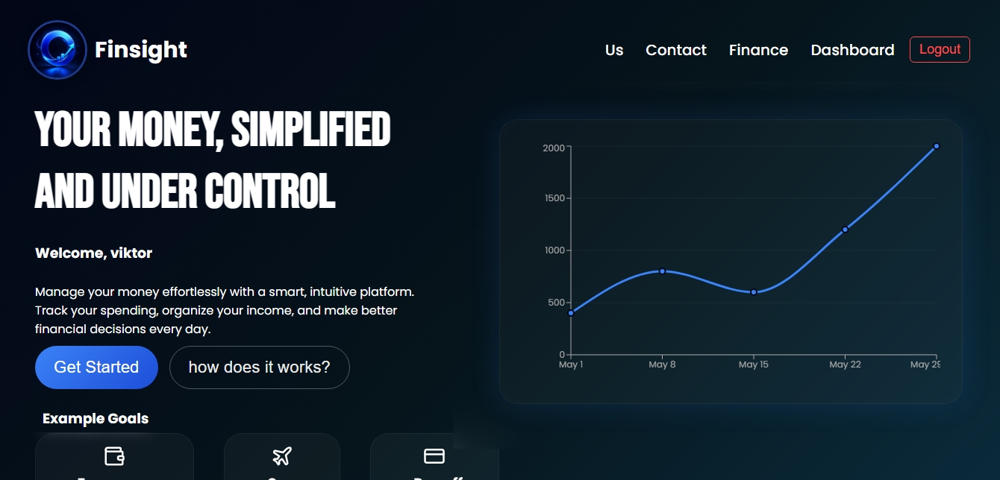
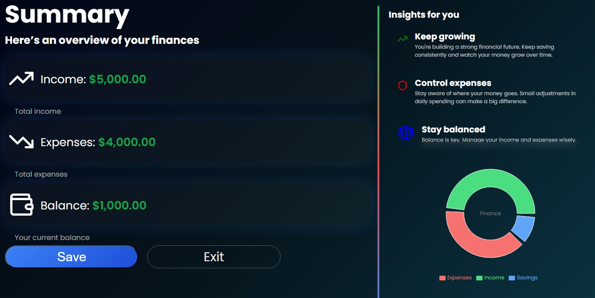

# FinSight

FinSight is a modern financial management web application designed to help users track, analyze, and improve their personal finances in a simple and intuitive way.

## Preview

### Home


### Form



### Summary



### Dashboard


### Mobile View


## Features

* User authentication (login & register)
* Financial dashboard with real-time data
* Expense and income tracking
* Data visualization with charts
* Clean and responsive UI

## Technologies Used

* Frontend: React.js
* Backend: Node.js / Express
* Database: MongoDB
* Styling: CSS

## Purpose

The goal of this project is to provide a complete fullstack experience, covering everything from backend logic and database management to frontend interface and user experience.

## Installation

```bash
git clone https://github.com/your-username/finsight.git
cd finsight
npm install
npm start
```

## Deployment

This project is deployed using Vercel (frontend) and a backend server.

## Learning Goals

* Understand fullstack development
* Practice authentication systems
* Work with APIs and databases
* Improve UI/UX design skills

## Author

Developed by Viktor Angelo
