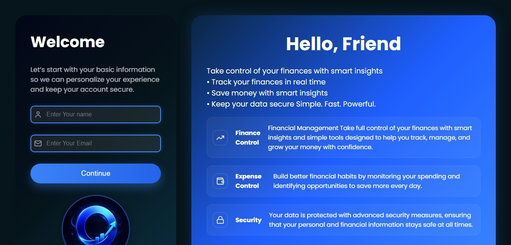
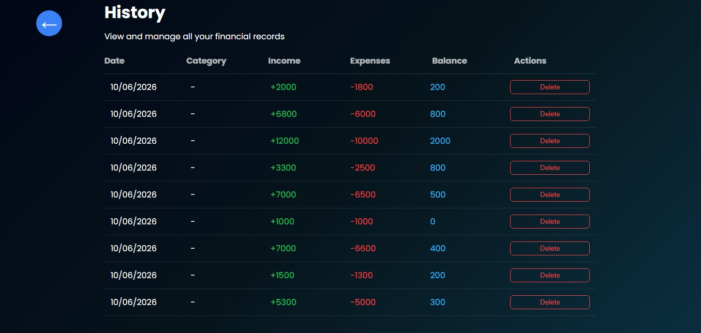
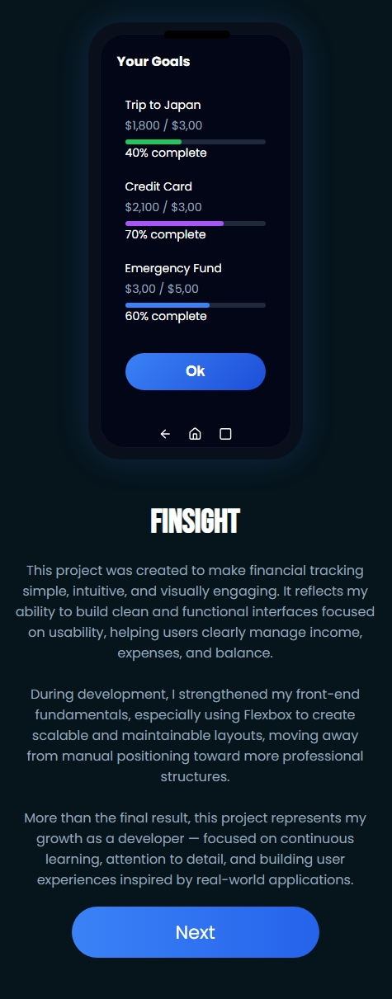

## FinSight

FinSight is a modern fullstack financial management web application designed to help users track, analyze, and improve their personal finances in a simple and intuitive way.

The project focuses on delivering a clean user experience while applying real-world fullstack development concepts such as API integration, authentication, and data visualization.

## Live Demo

 https://finsight-5hpf.vercel.app

## Preview
### Home
 
### Form

### Summary

### Dashboard 

### Mobile View

## Features
User authentication (login & register)
Financial dashboard with real-time data
Expense and income tracking
Data visualization with charts
Clean, responsive, and user-friendly interface
 Tech Stack

Frontend

React.js
Vite
CSS

Backend

Node.js
Express

Database

MongoDB

Tools & Deployment

Git & GitHub
Vercel (frontend)
Backend hosted separately
## Purpose

The main goal of this project is to simulate a real-world fullstack application, covering:

Backend development and API creation
Database integration and data handling
Frontend interface and user experience
Communication between client and server
## Learning Experience

During the development of this project, I was able to:

Build a fullstack application from scratch
Implement authentication flows
Work with REST APIs and database integration
Structure a real project using Git and multiple commits
Improve UI/UX design and responsiveness
Handle real application logic and state management
## Future Improvements
More advanced data filtering (monthly/yearly reports)
Enhanced dashboard with deeper analytics
Performance optimizations
Improved UX interactions and animations
## Installation
Clone the repository
git clone https://github.com/Viktor-angelo/Finsight.git
cd Finsight
Install dependencies
npm install
Run the project
Frontend
cd frontend
npm run dev
Backend
cd backend
npm run dev
## Project Structure
Finsight/

 ├── backend/
 
 ├── frontend/
 
 ├── Images/
 
 └── README.md
 
## Deployment

The frontend is deployed on Vercel, while the backend runs on a separate server, enabling a fullstack architecture with real-time data handling.

## Author

Developed by Viktor Angelo

## Final Note

This project was built as part of my learning journey in fullstack development, focusing on creating a practical and realistic application that reflects real-world scenarios.
